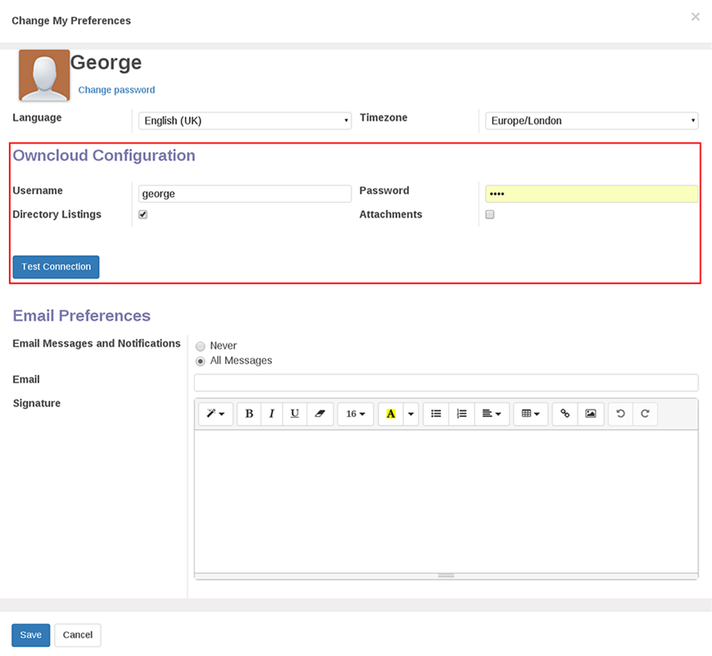

Configuration
=============

In order to attach documents or view listings, you first need to setup the Owncloud configuration properties from an Odoo Administrator account, then you need to setup the connection properties for a user in a specified Ownloud group. Both of these connection properties will be valid Owncloud login details.

Attachments
-----------

In order to attach documents from Owncloud to Odoo, click on Dashboards->Owncloud tab (for Odoo version 8, click on Settings-Owncloud instead), and select 'Configuration' and create a new entry.
Create a new configuration properties record by entering a name for the connection properties and the appropriate  host, login and password values. Choose the 'Attachments' flag for attachments.
Test the connection properties by ticking the 'Configure Owncloud Directory', enter an Initial directory to read' as appropriate or leave as '/', and press the 'Test Connection' button.

.. image:: attach.png

Owncloud Directory
------------------
In order to view the contents of an owncloud directory, either create a second configuration record with the appropriate owncloud connection properties, and choose the 'Directory Listings' flag.This is the default if no flag is selected
Alternatively you may toggle the flag in the attachment configuration created above, and modify the ' Initial directory to read' as appropriate.
Test the connection properties by clicking the 'Test Connection' button.

.. image:: list.png

User Preferences
----------------
In order for a user to be able to use the Owncloud Connect application, the administrator will provide a valid Owncloud Login details, these details will be entered in the User Preferences; Click open the Preferences form and in the Owncloud Configuration section, enter the login details and choose the appropriate Listings/Attachments check box, and save the properties. You may test the connection by clicking the 'Test Connection' button.

.. image:: preferences.png

|
|

|

Notes:

.. [#] In order for a user to be able to modify the Owncloud Configuration section of their preferences, the administrator may need to grant write access to res_users_all via Settings->Security->Access Control List. 
 
.. [#] The maximum number of Owncloud Configuration entries that can be defined by the administrator is 2; one for Directory Listings and one for Attachments.The Owncloud location and login details need not be the same.

.. [#] The 'Initial directory to read' on the configuration screen is used solely for testing owncloud connection by the administrator, and is not relevant to the group access granted to a particular user. This will be set in Owncloud.

.. [#] If this application is installed in Odoo version 8, the admin configuration screen will be installed under the 'Settings' menu tab and not 'Dashboard'.
