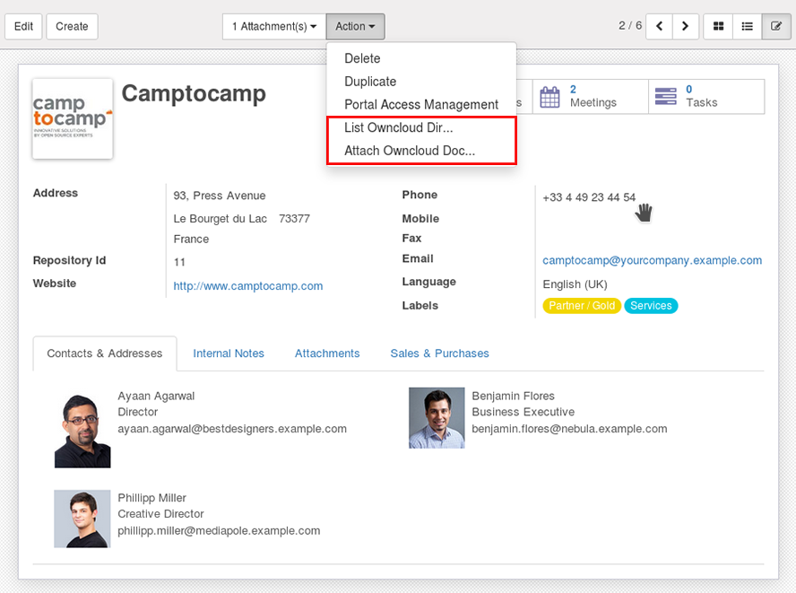

Owncloud Directory Naming Convention
====================================

The names of the directory in owncloud are named by the Odoo model responsible for the Odoo form. For instance, the underlying model responsible for the Leads screen is crm.lead, therefore the directory will be name 'crm_lead', swapping the period for an underscore.
The appropriate group access will be granted to this directory (no group access is granted to any parent(s) of this directory), and the 'can share' checkbox will be ticked.

.. image:: owncloud_dir.png

The subdirectories will be named based on the record you are currently viewing. Each record has a unique Repository ID, which is visible on the form.
The Owncloud-Connect application is currently configured to work from the following modules:

+---------------+--------------------+-----------------+
| Module        | Sub-directory Name | Field name      |
+===============+====================+=================+
| Employees     | hr_employee        | Employee_Name   |
|               |                    |                 |
| Customer      | res_partner        | Customer_Name   |
|               |                    |                 |
| Contacts      | res_partner        | Contact_Name    |
|               |                    |                 |
| Leads         | crm_lead           | Customer        |
|               |                    |                 |
| Opportunities | res_partner        | Customer        |
|               |                    |                 |
| Projects      | project_project    | Project_Name    |
+---------------+--------------------+-----------------+

So the directory structure in Owncloud will be <Sub-directory_Name>/<RepositoryId>_<Field_Name>/
For example for the Customer below, the Onwcloud directory will be: res_partner/11_Camptocamp/

If the Adminstrator is defining this, then access to the relevant group should be granted to <Sub-directory_Name>.

Kindly contact the developer, if configuration for other modules are requried.

Once the Owncloud settings have been entered and verified in the user preferences, click on the 'Action' pulldown of the appropriate form, and select "List Owncloud Dir...", or "Attach Owncloud Doc..." as appropriate.

This will create a share link URL for the owncloud directory and display its content.

.. image:: viewdir1.png

You may drill down to any related sub-directories from the share link URL.
You may also send the link to another person via e-mail etc.
