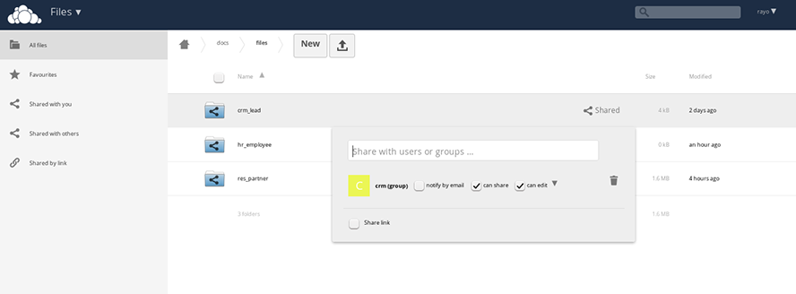

Owncloud Directory Naming Convention
====================================

The directories in owncloud are named according to the Odoo model responsible for the Odoo form. 

For instance, the underlying model responsible for the Leads screen is crm.lead, therefore the directory name will be 'crm_lead' (swapping the period for an underscore).

The appropriate group access will be granted to this directory (no group access is granted to any parent(s) of this directory), and the 'can share' checkbox will be ticked.

The subdirectories will be named based on the record you are currently viewing. Each record has a unique Repository ID, which is visible on the form.

The Owncloud-Connect application is currently configured to work for the following modules:

+---------------+--------------------+-----------------+
| Module        | Sub-directory Name | Field Name      |
+===============+====================+=================+
| Employees     | hr_employee        | Employee_Name   |
|               |                    |                 |
| Customers     | res_partner        | Customer_Name   |
|               |                    |                 |
| Contacts      | res_partner        | Contact_Name    |
|               |                    |                 |
| Leads         | crm_lead           | Customer        |
|               |                    |                 |
| Opportunities | cmr_lead           | Customer        |
|               |                    |                 |
| Projects      | project_project    | Project_Name    |
+---------------+--------------------+-----------------+

So the directory structure in Owncloud will be: <Sub-directory_Name>/<RepositoryId>_<Field_Name>/.

Case sensitivity of the <Field_Name> must be respected.

For example, for the Customer below, the Onwcloud directories will be: res_partner/11_Camptocamp/

If the Adminstrator is defining this, then access to the relevant group should be granted to <Sub-directory_Name>.

Avoid using forward slash ('/') in Field_Name, etc for obvious reasons.

Once the Owncloud settings have been entered and verified in the user preferences, click on the 'Action' pulldown of the appropriate form, and select "List Owncloud Dir...", or "Attach Owncloud Doc..." as appropriate.

Kindly contact the developer, if configuration for other modules are requried.
